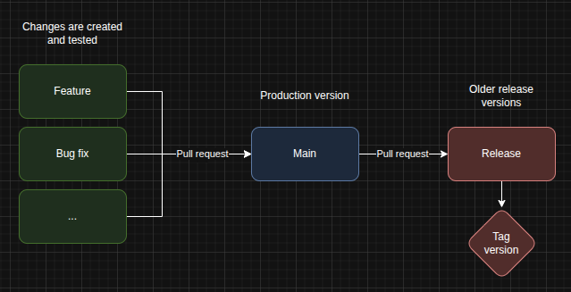

# VESPAS BIKE GANG :honeybee:

## Sumário

## [Layout](https://www.figma.com/design/jsvDCI2ZQxafnYibi1difD/Site-Vespas?node-id=0-1&p=f&t=mTE0yP3Xutl0zkMg-0)

## Tecnologias do projeto
Esse projeto é um site intucional criado em React com o *framework* Nextjs e usa o Contentful como plataforma de *CMS* (content managment system) para reutilizar componentes, criar páginas e importar conteúdo.
Como esse projeto foi construído usando Nextjs, o deploy dele pode ser feito na Vercel **Deploy pendente**.
Em caso de dúvida, você pode consultar [a documentação criada para o template desse projeto](https://github.com/vercel/next.js/tree/canary/examples/cms-contentful) ou a [documentação para Nextjs criada pela Contentful](https://www.contentful.com/nextjs-starter/)

### Bibliotecas e dependências
|Ferramenta|Versão|
|-|-:|
|[Node](https://nodejs.org/en)|^18.20.8|
|[Nextjs](https://nextjs.org/)|^15.3.4|
|[Contentful](https://www.contentful.com/)|-|
|[Vercel](https://vercel.com)|-|

### Comandos do projeto
``` bash
  #Instalar dependências
  npm install

  #Iniciar servidor local
  npm run dev
```

### Ambientes
- **Desenvolvimento:** [localhost:3000](http://localhost:3000)
- **Ambiente de produção pendente**
- **Ambiente de rascunho (draft):** Para consulta de dados sem precisar publicar as alterações no CMS
``` bash
http://localhost:3000/api/draft?secret=<CONTENTFUL_PREVIEW_SECRET>&slug={entry.fields.slug}
```

## Gitflow
### Fluxo de commits
O projeto é baseado em 2 *branchs* permanentes (`main` e `release/*`) e as *branchs* temporárias (`feature`, `fix`, `config` e `change`). As *branchs* permanentes tem por intuito marcar os *milestones* do site, servindo como referência das versões existentes do site. Essas *branchs* não podem ser alteradas diretamente, mas sim via *pull requests* que devem ser devidamente revisados e aprovados.
Já as *branchs* temporárias, devem ser criadas localmente e servem para conter as alterações do site que posteriormente serão *mergeadas* nas *branchs* permanentes.



### Tipos de alteração
Os commits e *branchs* tem tipos que indicam como a alteração afeta o projeto e devem estar presentes nas descrições de ambos, de forma a deixar claro o propósito da alteração.
- **Feature**: Funcionalidade nova (feature).
- **Fix**: Ajuste de bugs (bug fix).
- **Config**: Configuração do projeto (configuration).
- **Change**: Atualização que não esteja relacionada à algum concerto, como troca de imagem ou atualização de texto (change).
- **Release**: Deve ser usada para separar as versões do site e deve ter uma tag relacionada a ela.
- **Main**: A *branch* principal do projeto, usada para gerar os deploys em produção.
  
### Commits
Os commits devem conter uma descrição clara das alterações que foram feitas, em inglês. Eles não devem conter mais do que uma alteração em cada commit e precisam indicar a ação que o commit faz (começe a descrição com um verbo). Caso haja um *issue* relacionado a esse commit, o número do *issue* deve estar presente na descrição.
``` bash
  #Padrão
  [Número do issue] Tipo de ação: Descrição em inglês iniciando com um verbo
  #Exemplo
  git commit -m "#13 Fix: Fix login button redirect" #com issue relacionado
  git commit -m "#21 Feature: Add link to contact page on navigation menu" #com issue relacionado
  git commit -m "Config: Update readme information about gitflow" #sem issue relacionado
```

### Branchs
O nome da *branch* deve conter, além do seu tipo, uma breve descrição do que a *branch* contém, sempre em inglês. Caso haja algum *issue* relacionado a essa modificação, deve-se colocar o número do *issue* relacionado, para que se possa consultar o *issue*, tendo assim uma descrição mais completa da alteração.
``` bash
  #Padrão
  tipo/<Número do issue, caso houver>/Descricao-em-snake-case
  #Exemplo
  git checkout -b feat/13/create-slider-component //com issue relacionado #com issue relacionado
  git checkout -b config/add-environment-config-file #sem issue relacionado
```

### Tags
As tags são responsáveis por marcar o versionamento do site e devem ser criadas sempre que uma nova versão do site for lançada.
```bash
  #Padrão
  v<Número da versão> "Descrição da Mudança - Informação adicional"

  #Exemplo
  git tag -a v1.0 -m "First launch - Layout v1.0 on Nextjs and Contentful"
  git tag -a v2.0 -m "Ecommerce launch - Connect to shopify"
```

## Ferramentas de suporte
Algumas ferramentas foram selecionadas para avaliar o site e gerar insights para melhoria do código e layout.
- **[Google Lighthouse:](https://developer.chrome.com/docs/lighthouse?hl=pt-br)** Avalia a perfomance do site, análisando tópicos importantes como tempo de carregamento e SEO.
- **[Wave:](https://wave.webaim.org/)** Ferramenta de análise de acessibilidade, sugerindo melhorias e pontos que merecem atenção.